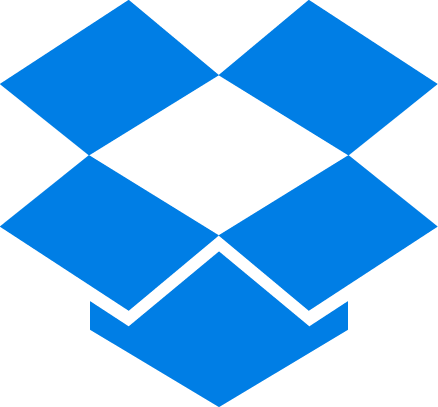
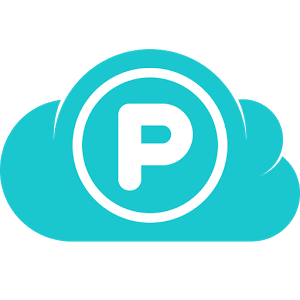
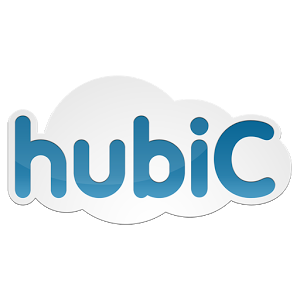
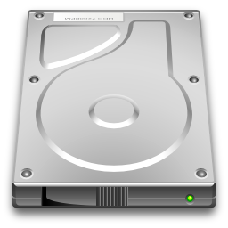

*Cloud Browser* is available on *Microsoft Store* and *Google Play Store*. 

The app allows:
* easy management of multiple cloud storage accounts
* playing media files directly from cloud

Currently it supports browsing through the following cloud storage-like services:

<ul class="cloud-list">
  
  <li>Google Drive</li>
  <li>Dropbox</li>
  <li>OneDrive</li>
  <li>Box</li>
  <li>pCloud</li>
  <li>hubiC</li>
  <li>MEGA</li>
  <li>Yandex.Disk</li>
  <li>AmazonS3</li>
  <li>WebDAV</li>
  <li>Google Photos</li>
  <li>Local drive</li>
</ul>

All versions of the app are built on top of open source 
[`libcloudstorage`](https://github.com/lemourin/libcloudstorage) library.
If you need new cloud storage services added, you are strongly encouraged to 
implement them in [`libcloudstorage`](https://github.com/lemourin/libcloudstorage).